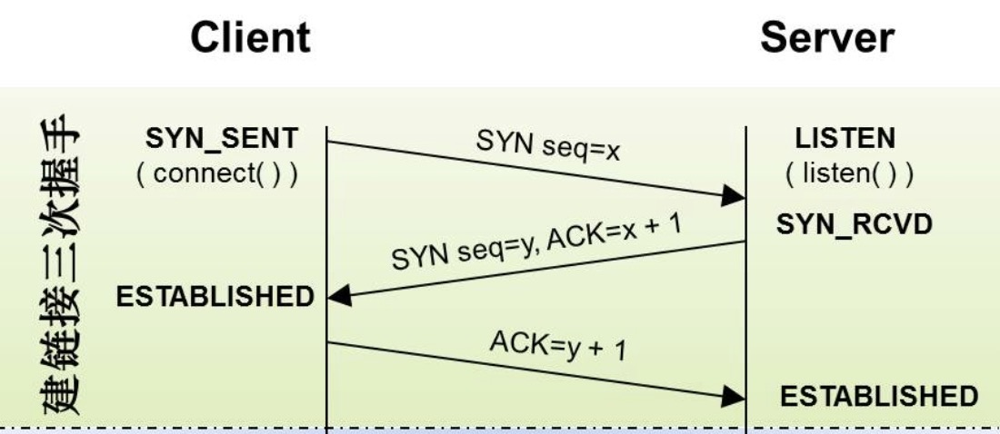
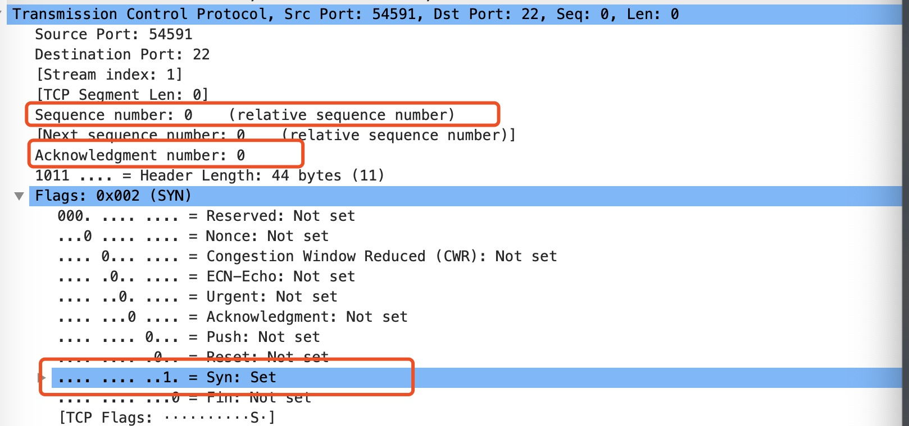
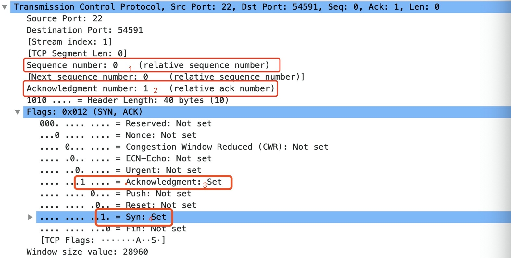
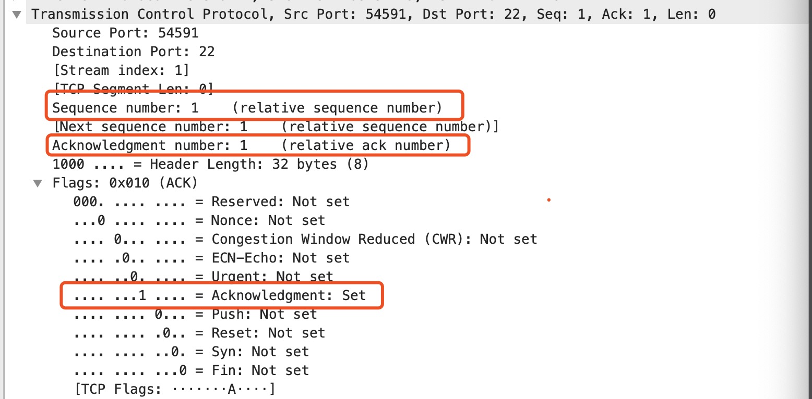

`nmap`中有不少扫描算法，包括`-sS(TCP SYN scan)/-sT(TCP connect scan)/-sU(UDP scans)`。

- 基础知识

  在详细分析`nmap`扫描算法之前，不得不先分析一下`TCP`建立连接的三次握手 ，三次握手过程如下图所示：

  

​		三次握手建立连接的数据包(使用命令为 `ssh`)如下所示：

​	

​	三次握手在数据

- TCP SYN scan
  - nmap命令：-sS
  - 

---

参考文章：

1. 