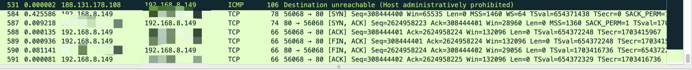

[toc]


`nmap`中有不少扫描算法，包括`-sS(TCP SYN scan)/-sT(TCP connect scan)/-sU(UDP scans)`。

### TCP基础知识

在详细分析`nmap`扫描算法之前，先回顾一下`TCP`建立连接的三次握手 ，三次握手过程如下图所示：


​		三次握手建立连接的数据包(使用命令为 `ssh`)如下所示：

​		

​		在第一次握手的时候，标志位会设成`SYN`，同时会发送一个`Seq Number`，在这个数据包中 `Seq Number = 2186387149`		


​	第二次握手的时候，标志位会被设置为`SYN和ACK`，同时 `ACK Number = Seq Number + 1`， `Seq Number = 2071329386`

​	

​	第三次握手的时候，标志位会被设置为`ACK`，同时 `ACK Number = Seq Number + 1`

以上是正常建立三次握手的过程，当我们想要请求连接一个不存在的端口时，会发送什么样的数据报呢？

> 根据《TCP/IP详解：卷1》18.7.1可知，当连接到不存在端口的时候，该端口如果没有进程正在听，对于UDP，当一个数据报到达目的端口时，该端口没在使用，它将产生一个ICMP端口不可达的信息。而TCP则使用复位。


### nmap扫描算法

#### TCP SYN scan

#### #nmap命令 -sS

#### #open端口流量分析


​																		上述数据报所使用的命令为 `nmap -sS IP`，扫描结果`443`是开放的

我们以`443`端口扫描为例，分析`324,334,335`数据报。

```c
324: 37796->443 SYN
334: 443->37796 SYN,ACK
335: 37796->443 RST
```

通过数据报可以看到，当使用`TCP SYN scan`进行扫描的时候且端口开放时，会涉及到三个数据报：

---

1. `nmap`发送 `SYN` 数据报 给指定端口 ---> nmap发送数据报
2. 收到返回`SYN ACK`数据报 --->目标IP发回数据报
3. `nmap`发送`RST`数据报到目标端口 ---> nmap发送数据报

---

以上两步和建立`TCP`连接的前两次握手是相同的

#### #filtered端口数据报分析


我们以`3306`端口为例，扫描结果显示该端口为`filtered`状态，分析`344,397`数据报

```c
344: 48501--->3306 SYN
397: 48502--->3306 SYN
```

通过数据报可以看到，当`nmap`进行端口扫描时，都会先发送一个`SYN`数据包进行探测，当一段时间后`nmap`没有收到返回数据报，会再次发送一个`SYN`探测包， 若依然没有响应，则判断该端口为`filterd`状态。重传的时间间隔为多长，可以自己设定。分析到这里其实有个问题，`filtered`端口的存在对于端口扫描是否有实际意义？

#### #close端口数据报分析

目前没有抓到关闭端口的数据报，无法分析。`nmap`官方文档显示，如果目标端口返回的是`RST`数据报，则端口为关闭状态。

#### TCP Connect Scan (-sT)

#### #nmap命令 -sT

#### #open端口数据报分析


以`443` 端口为例，分析`31,32,33,34`数据报。

```c
31: 52610-->443  SYN
32: 443--->52610 ACK, SYN
33: 52610--->443 ACK
52610--->443 RST, ACK
```

`31-33`数据报完成的`TCP`三次握手，建立了`TCP`连接。`34`数据报则是`nmap`发送`RST`数据报了结束`TCP`连接。所以相比起`TCP Connect Scan`，`TCP SYN Scan`更加隐秘。

#### #close端口数据报分析


使用`TCP Connect Scan`扫描时，若端口关闭，则会收到`ICMP`不可达的数据包。对于已经关闭的端口并不会做再次发送`SYN`数据报的操作，所以相比起`SYN Scan`，这种扫描方式不会造成网络拥堵。

#### UDP Scan (-sU)

### NMAP端口扫描代码分析

本着既然研究一个东西，就好好研究的观点，我还是决定看看`NMAP`的源码。但在源码分析这一部分，只浅析端口扫描部分的代码。

#### 入口函数

端口扫描的主要代码分布在`scan_engine.cc`，`scan_engine_connect.cc`和`scan_engine_raw.cc`中。入口函数为 `ultra_scan`，函数声明如下：

```cpp
void ultra_scan(std::vector<Target *> &Targets, struct scan_lists *ports, stype scantype, struct timeout_info *to)
```

#### 参数介绍

- `std::vector<Target *> &Targets` =====> 需要扫描的目标

- `struct scan_lists *ports` ======> TCP或者UDP的端口和一些协议

  ```cpp
  struct scan_lists {
          unsigned short *tcp_ports;
          int tcp_count;
          unsigned short *udp_ports;
          int udp_count;
          unsigned short *prots;
          int prot_count;
  }; 
  ```

  

- `stype scantype` ======>  nmap扫描的方式

  ```cpp
  typedef enum {
    STYPE_UNKNOWN,
    HOST_DISCOVERY,
    ACK_SCAN,
    SYN_SCAN,
    FIN_SCAN,
   	....
    SCRIPT_POST_SCAN,
    TRACEROUTE,
    PING_SCAN_ND
  } stype;
  ```

- `timeout_info` =====> 存放超时信息

#### 数据结构

- `UltraScanInfo`

  每一次扫描都会创建一个`UltraScanInfo`实例。

  ```cpp
  scan_engine.cc:2749 UltraScanInfo USI(Targets, ports, scantype);
  ```

  进入类中，其中定义了一些布尔变量，用来标志扫描类型。其中还包含`GroupScanStats`类，该类用于记录整个扫描过程的相关数据。除此之外，还包含一些没有完成扫描的主机，每一个该类型的主机会抽象为一个`HostScanStats`类来表示。

- `UltraProbe`

  `UltraProbe`表示一种可以被用于扫描端口的探针。在`HostScanStats`中包含着一系列的探针，可以将它们设置为`IP`, `connect`或者`ARP`探针，其使用的方法为`setIP()`, `setConnect()`, `setARP()` 。这三个函数的实现在`scan_engine_raw.cc`中，等后面可以仔细分析一下。

  ```cpp
    void setIP(u8 *ippacket, u32 iplen, const probespec *pspec);
    /* Sets this UltraProbe as type UP_CONNECT, preparing to connect to given
     port number*/
    void setConnect(u16 portno);
    /* Pass an arp packet, including ethernet header. Must be 42bytes */
    void setARP(u8 *arppkt, u32 arplen);
    void setND(u8 *ndpkt, u32 ndlen);
  ```

- `probespec`

  设置`IP`探针的时候，会使用到这个结构体。

  ```cpp
  typedef struct probespec {
    /* To save space, I changed this from private enum (took 4 bytes) to
       u8 that uses #defines above */
    u8 type;
    u8 proto; /* If not PS_ARP -- Protocol number ... eg IPPROTO_TCP, etc. */
    union {
      struct probespec_tcpdata tcp; /* If type is PS_TCP or PS_CONNECTTCP. */
      struct probespec_udpdata udp; /* PS_UDP */
      struct probespec_sctpdata sctp; /* PS_SCTP */
      struct probespec_icmpdata icmp; /* PS_ICMP */
      struct probespec_icmpv6data icmpv6; /* PS_ICMPV6 */
      /* Nothing needed for PS_ARP, since src mac and target IP are
         avail from target structure anyway */
    } pd;
  } probespec;
  ```

  

#### ultra_scan()函数流程

- 随机生成一个用于扫描的端口

- 如果扫描目标为空，则返回
- 创建`UltraScanInfo`对象

- 如果为 `raw scan`，则调用 `begin_sniffer()`。这个函数调用了 `netutil.h`中的`my_pcap_open_live()` ，其封装了`libpcap`中的`pcap_open_live()`。

  - 除了`TCP connect scan`，其他扫描方式都为 `raw scan`。

- 扫描主循环

  1. `doAnyPings()`： 探测主机是否存活；

  2. `doAnyOutstandingRetransmits()`:  遍历每个主机的`ProbeQueue`， 如果发现有超时的`probe`，则重新发送

  3. `doAnyRetryStackRetrasmits()/doAnyNewProbes()`: 这两个函数本质上的区别是，前者是针对已经发送过的`probes`进行再次发送操作，而后者是对新的端口进行发送`probe`操作。
  4. 帮助函数---->`gettimeofday()`, `printAnyStats()`
  5. `waitForResponses()`: 获取并解析`begin_sniffer()`截获的数据包，其中包括标记主机是否开启，端口是否开启。主要处理逻辑在`ultrascan_port_probe_update()`中
  6. `processData()`: 标记已经完成扫描的主机，设置超时`probe`。如果`probe`没有回复，则设置主机和端口的状态，主要是`scantype_no_response_means()`处理。

### NMAP绕过IDS


### 其他扫描方式

#### socket扫描

#### #代码

```python
async def Scan(ip, port):
    try:
        reader, writer = await asyncio.open_connection(host=ip, port=port)
        writer.close()
        await writer.wait_closed()
    except Exception as e:
        return False
    else:
        result_port.append(port)
        return result_port
```

#### #数据报分析



这一系列的数据报为通过socket方式扫描目的IP的80端口，返回的数据报。其中`584,587,588`三个数据报为TCP建立连接的三次握手包。


---

参考文章：

1. 《TCP/IP详解：卷1》
2. https://nmap.org/book/man-port-scanning-techniques.html
3. https://www.bamsoftware.com/wiki/Nmap/ScanEngine